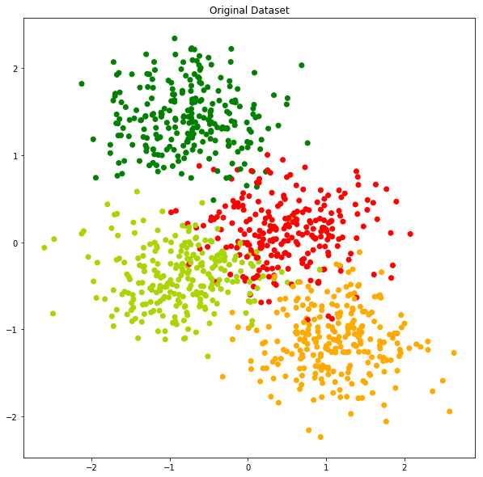
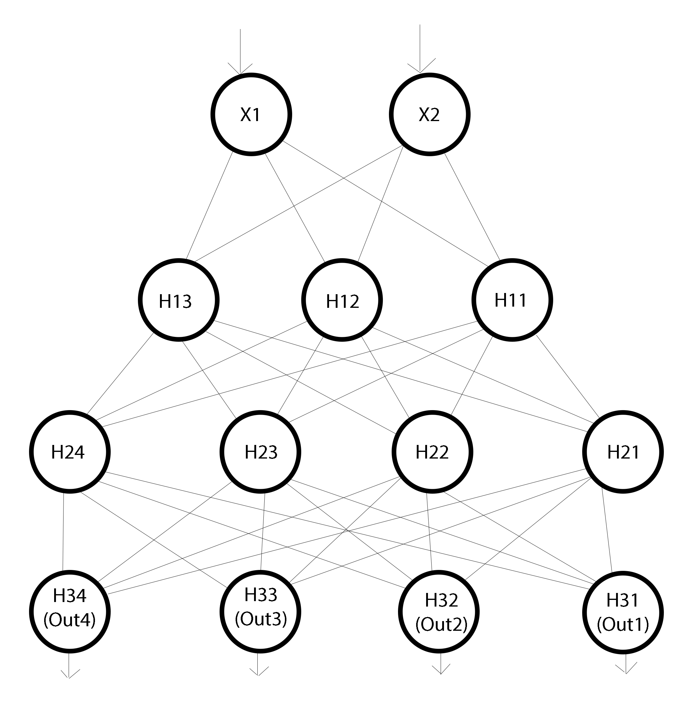
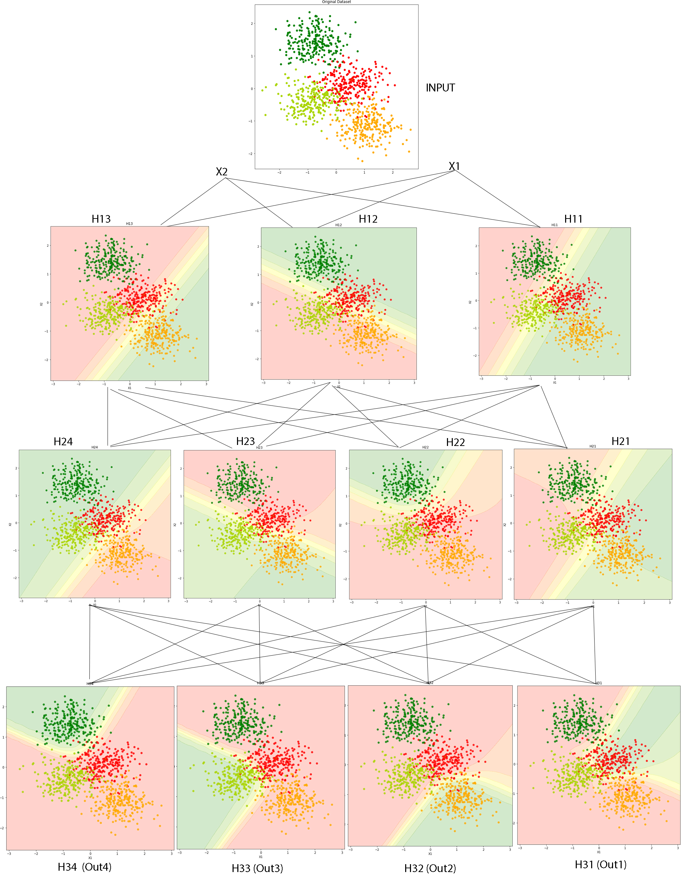

# Feed Forward Neural Network using Numpy

This repository contains the Numpy-implemented Fully Connected Feed Forward Neural Network from scratch. It is a general class that can be applied on any type of dataset. It has functionality to use different weight initialisation methods like random, Xavier and He. There are different activation functions like sigmoid, tanh, relu and leaky_relu. 
This also contains different optimizers with functionality to set the corresponding hyper parameters. Optimizers included are :- Vanilla GD, Momentum Based, Nesterov Accelerated Gradient, AdaGrad, RMSProp and Adam.

> Alongside the class definition, the "Final_Feed_Forward_Neural_Network.ipynb" has also a cool visualization of every neuron of dataset for a sample architecture of 2 input neurons, first hidden layer with 3 neurons , second hidden layer with 4 neurons and 4 output neurons. The dataset used is toy dataset generated randomly from sklearn.datasets .

## Getting Started

These instructions will help you to build up the environment to build a copy of the project up and running on your system.

### Prerequisites
To run this project on your system, you need following softwares and python module installed on your system:

* [Anaconda](https://www.anaconda.com/distribution/)
* Numpy
* Matplotlib
* tqdm_notebook
* sklearn (for toy dataset generation and data preprocessing)
* mpl_toolkits (for datavisualization in 3D)

After installing Anaconda, the following commands will help you install the python modules.

```
pip install numpy
pip install matplotlib
pip install sklearn
pip install tqdm
pip install mpl_toolkits
```

# Class definitions and method descriptions

## Instantiating object of the model
```
model = FeedForwardNeuralNetwork(n_input = 2, n_output = 1,
								hidden_sizes = [3],  init_method = 'random',
								activation_function='sigmoid', 
								leaky_slope = 0.1)
```
* <b>n_input</b>: Number of input features. Default value is 2
* <b>n_ouput</b>: Number of neurons in output layer (Number of Classes). Default value is 1
* <b>hidden_sizes</b>: It a list where each element represent the number of neurons in corresponding hidden layer. Length of list defines the number of hidden layers. For example, hidden_size = [3,4] represents 2 hidden layers with first hidden layer with 3 neurons and second hidden layer with 4 neurons. Default value is [3].
* <b>init_method</b>: This parameter defines the weight initialization method. Different Weight initialization methods are "xavier", "he" and "random". Default value is "random".
* <b>activation_function</b>: This parameter defines the activation function for hidden layers. Different Activation Function available are "sigmoid", "tanh", "relu", "leaky_relu". Default value is "sigmoid".
*<b>leaky_slope</b>: This defines the slope of the leaky region of leaky_relu when used. This is an optional parameter when leaky_relu is not used. Default value is 0.1.


## Training the model
 ```
 model.fit(X,Y,X_val,Y_val,optimizer='vanilla',
 		  l2_norm=False,lambda_val=0.8, gamma=0.9,
		   beta = 0.1, beta1=0.9,beta2=0.9, 
		   mini_batch_size=32,learning_rate = 1,
		   epochs = 1,display_loss = False)
 ```

* <b>X</b>: Input Train Dataset of correct dimensions
* <b>Y</b>: One-Hot-Encoded label for train data
* <b>X_val</b>: Validation data
* <b>Y_val</b>: One-hot Encoded label for validation set.
* <b>optimizer</b>: This parameter defines the optimizer used for backpropagation. Different available optimizers are "vanilla", "momentum", "nag", "adagrad", "rmsprop" and "adam". Default value is "vanilla"
* <b>l2_norm</b>: It is a boolean parameter. True means the model should apply L2 normalization. False mean L2 Normalization should be ommitted. With True value, the value of weight penaly, lambda_val, can be changed accordingly. Deafult value is False
* <b>lambda_val</b>:Weight Penalty value for l2_norm. Default value is 0.8.
* <b>gamma</b>: Acceleration value for momentum based gradient. Default value is 0.9. 
* <b>beta</b>: Parameter for rmsprop based gradient descent. Default value is 0.1.
* <b>beta1 and beta2</b>: Parameters for adam optimizer. Default values are beta1 = 0.9 and beta2 = 0.9
* <b>mini_batch_size</b>: input batch size. Default value is 32.
* <b>learning_rate</b>: learning rate. Default value is 1.
* <b>epochs</b>: Number of epochs. Default value is 1
* <b>display_loss</b>: This is a boolean parameter. If set True, after training, the training and validation loss will be plotted. This needs *import matplotlib.pyplot as plt* to be loaded. Default value is False. 

## Predicting output
```
output = model.predict(input)
```
Input should be dimensionally correct (same as input while trained). The ouput will be an array of probabilities of length of number of classes. The index with maximum probability is the predicted class.
```
Y_pred = numpy.argmax(output.T,1)
```

### Output of a Particular Neuron
```
output_h = model.predict_h(X,L,i)
```
*model.predict_h()* will give output of neuron of L-th layer's i-th neuron.


# Cool Visualizations
### Toy Dataset
For demonstration, the toy dataset with 4 output class, and 2 input feature is generated. The dataset plot is shown below.
<br>

<br>
<b>X-axis: X1 and Y-Axis: X2</b>

### Neural Net Architecture
For the demonstration, in this project, a feed forward network with 2 input units, 2 hidden layers with 3 neurons and 4 neurons respectively and an output layer with 4 neurons corresponding to the number of classes of dataset. The diagram of Neural Net architecture is shown below:
<br>


### Every Neuron's Output
Below is the output of every neuron for the toy dataset. To make it intuitive, I have made the output also in neural network form so that the idea behind the neural networks can be grasped.
<br>
<br>

<br>
From the above diagram, we can observe how non-linearity increases with increasing depth of the neural network. Finally, every neuron of output layer is able to classify one of the classes. This diagram gives us pretty good intuition of how a neural network works. 3D-Plot can also be plotted instead of contours which will give much better intuition of the neural networks and Universal Approximation Theorem.

# About Me

You can check my other projects on:
* [Github](https://github.com/rajivnayanc)
* [LinkedIn](https://www.linkedin.com/in/rajivnayanc/)